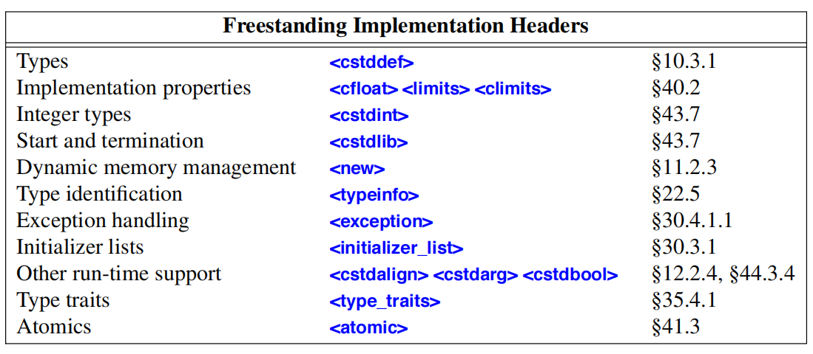
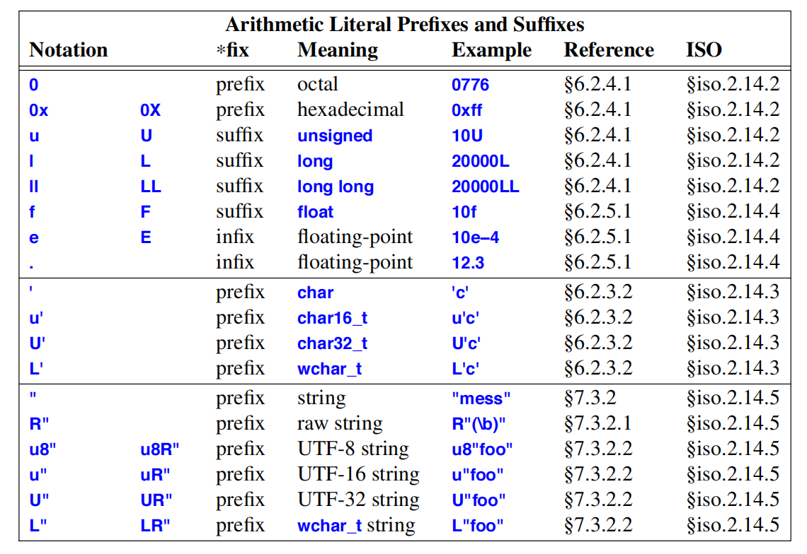
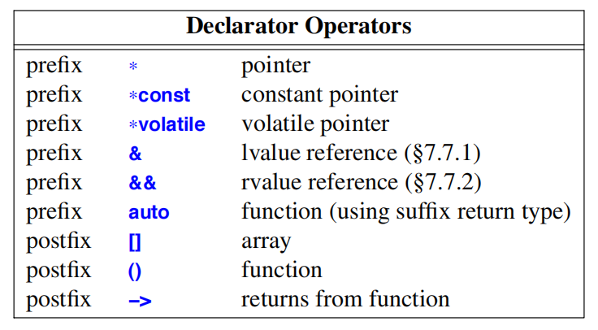
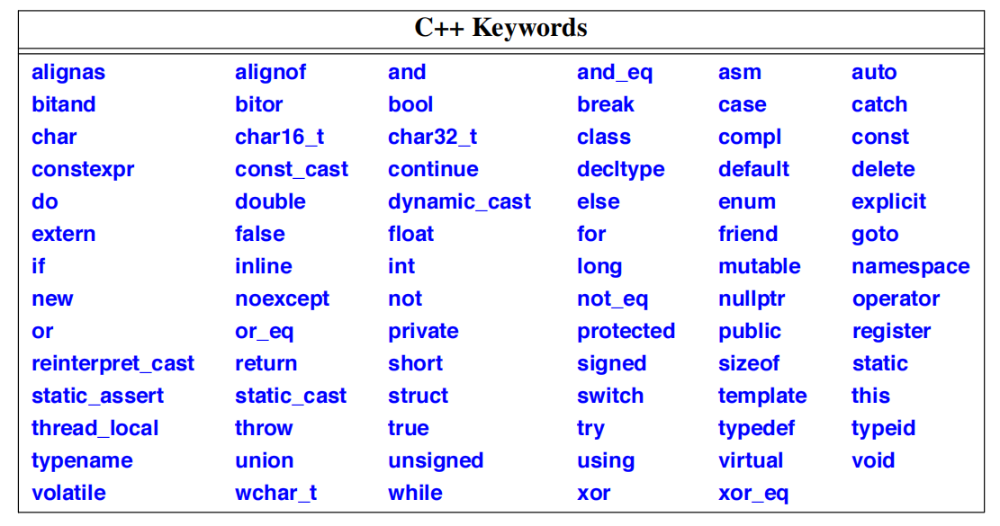
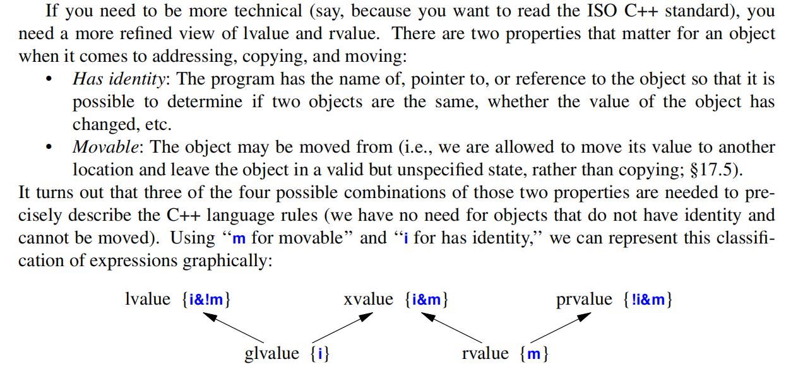

# Types and Declarations
## The ISO C++ Standard
- Strictly adhering to the C++ language and library standard doesn’t by itself guarantee good code or even portable code. The standard doesn’t say whether a piece of code is good or bad; it simply says what a programmer can and cannot rely on from an implementation.
- To maximize portability, it is wise to be explicit about what implementation-defined features we rely on and to isolate the more subtle examples in clearly marked sections of a program. A typical example of this practice is to present all dependencies on hardware sizes in the form of constants and type definitions in some header file.
- It is worth spending considerable time and effort to ensure that a program does not use something deemed unspecified or undefined by the standard.
### Implementations


## Types
- Every name (identifier) in a C++ program has a type associated with it. This type determines what operations can be applied to the name (that is, to the entity referred to by the name) and how such operations are interpreted.
### Fundamental Types
- C++ has a set of fundamental types corresponding to the most common basic storage units of a
computer and the most common ways of using them to hold data:
    - §6.2.2 A Boolean type (`bool`)
    - §6.2.3 Character types (such as `char` and `wchar_t`)
    - §6.2.4 Integer types (such as `int` and `long long`)
    - §6.2.5 Floating-point types (such as `double` and `long double`)
    - §6.2.7 A type, `void`, used to signify the absence of information
- From these types, we can construct other types using declarator operators:
    - §7.2 Pointer types (such as `int∗`)
    - §7.3 Array types (such as `char[]`)
    - §7.7 Reference types (such as `double&` and `vector<int>&&`)
- In addition, a user can define additional types:
    - §8.2 Data structures and classes (Chapter 16)
    - §8.4 Enumeration types for representing specific sets of values (`enum` and `enum class`)
- For most applications, we could use `bool` for logical values, `char` for characters, `int` for integer values, and `double` for floating-point values.
### Booleans
- A Boolean, `bool`, can have one of the two values `true` or `false`. A Boolean is used to express the results of logical operations.
- By definition, `true` has the value `1` when converted to an integer and `false` has the value `0`. Conversely, integers can be implicitly converted to `bool` values: nonzero integers convert to `true` and `0` converts to `false`.
- In arithmetic and logical expressions, `bool`s are converted to `int`s; integer arithmetic and logical operations are performed on the converted values.
- A pointer can be implicitly converted to a `bool` (§10.5.2.5). A non-null pointer converts to `true`; pointers with the value `nullptr` convert to `false`.
### Character Types
- It is safe to assume that the implementation character set includes the decimal digits, the 26
alphabetic characters of English, and some of the basic punctuation characters. It is not safe to
assume that:
    - There are no more than 127 characters in an 8-bit character set (e.g., some sets provide 255 characters).
    - There are no more alphabetic characters than English provides (most European languages provide more, e.g., æ, þ, and ß).
    - **The alphabetic characters are contiguous (EBCDIC leaves a gap between 'i' and 'j').**
    - Every character used to write C++ is available (e.g., some national character sets do not provide {, }, [, ], |, and \).
    - A `char` fits in 1 byte. There are embedded processors without byte accessing hardware for which a `char` is 4 bytes. Also, one could reasonably use a 16-bit Unicode encoding for the basic `char`s.
- Unfortunately, the choice of signed or unsigned for a plain char is implementation-defined.
#### Signed and Unsigned Characters
- A `char` must behave identically to either a `signed char` or an `unsigned char`. However, the three `char` types are **distinct**, so you can’t mix pointers to different `char` types.
#### Character Literals
- A *character literal* is a single character enclosed in single quotes, for example, `'a'` and `'0'`. The type of a character literal is `char`.
- The use of character literals rather than decimal notation makes programs more portable.
- Using any numeric notation for characters makes a program nonportable across machines with different character sets.
- It is possible to enclose more than one character in a character literal, for example, `'ab'`. Such uses are archaic, implementation-dependent, and **best avoided**. The type of such a multicharacter literal is `int`.
- The shorter notation `u'\uXXXX'` is equivalent to `U'\U0000XXXX'` for any hexadecimal digit `X`. A number of hexadecimal digits different from four or eight is a lexical error.
### Integer Types
- The `unsigned` integer types are ideal for uses that treat storage as a bit array.
- Using an `unsigned` instead of an `int` to gain one more bit to represent positive integers is almost never a good idea.
- Unlike plain `char`s, plain `int`s are **always** signed.
#### Integer Literals
- A literal starting with zero followed by `x` or `X` (`0x` or `0X`) is a hexadecimal (base 16) number. A literal starting with zero but not followed by `x` or `X` is an octal (base 8) number.
- Yes, plain `0` is octal, rather than decumal.
- Octal and hexadecimal notations are most useful for expressing bit patterns.
- The suffix `U` can be used to write explicitly `unsigned` literals. Similarly, the suffix `L` can be used to write explicitly `long` literals. Combinations of suffixes are allowed.
- It is a good idea to limit the use of nonobvious constants to a few well-commented `const` (§7.5), `constexpr` (§10.4), and enumerator (§8.4) initializers.
#### Types of Integer Literals
In general, the type of an integer literal depends on its form, value, and suffix:
- If it is decimal and has no suffix, it has the first of these types in which its value can be represented: `int`, `long int`, `long long int`.
- If it is octal or hexadecimal and has no suffix, it has the first of these types in which its value can be represented: `int`, `unsigned int`, `long int`, `unsigned long int`, `long long int`, `unsigned long long int`.
- If it is suffixed by `u` or `U`, its type is the first of these types in which its value can be represented: `unsigned int`, `unsigned long int`, `unsigned long long int`.
- If it is decimal and suffixed by `l` or `L`, its type is the first of these types in which its value can be represented: `long int`, `long long int`.
- If it is octal or hexadecimal and suffixed by `l` or `L`, its type is the first of these types in which its value can be represented: `long int`, `unsigned long int`, `long long int`, `unsigned long long int`.
- If it is suffixed by `ul`, `lu`, `uL`, `Lu`, `Ul`, `lU`, `UL`, or `LU`, its type is the first of these types in which its value can be represented: `unsigned long int`, `unsigned long long int`.
- If it is decimal and is suffixed by `ll` or `LL`, its type is `long long int`.
- If it is octal or hexadecimal and is suffixed by `ll` or `LL`, its type is the first of these types in which its value can be represented: `long long int`, `unsigned long long int`.
- If it is suffixed by `llu`, `llU`, `ull`, `Ull`, `LLu`, `LLU`, `uLL`, or `ULL`, its type is `unsigned long long int`.
### Floating-Point Types
- A floating-point number is an approximation of a real number represented in a fixed amount of memory.
#### Floating-Point Literals
- By default, a floating-point literal is of type `double`.
### Prefixes and Suffixes

### `void`
- there are no objects of type `void`.
- It is used either to specify that a function does not return a value or as the base type for pointers to objects of unknown type.
### Sizes
- Some of the aspects of C++’s fundamental types, such as the size of an `int`, are implementation-defined (§6.1).
- It is far easier to know and limit the impact of implementation dependencies when a program is written than to try to untangle the mess afterward.
- Sizes of C++ objects are expressed in terms of multiples of the size of a `char`, so by definition the size of a `char` is `1`. The size of an object or type can be obtained using the `sizeof` operator (§10.3). This is what is guaranteed about sizes of fundamental types:
    - 1 ≡ sizeof(char) ≤ sizeof(short) ≤ sizeof(int) ≤ sizeof(long) ≤ sizeof(long long)
    - 1 ≤ sizeof(bool) ≤ sizeof(long)
    - sizeof(char) ≤ sizeof(wchar_t) ≤ sizeof(long)
    - sizeof(float) ≤ sizeof(double) ≤ sizeof(long double)
    - sizeof(N) ≡ sizeof(signed N) ≡ sizeof(unsigned N)
- In addition, it is guaranteed that a `char` has at least 8 bits, a `short` at least 16 bits, and a `long` at least 32 bits.
- If a value `v` can be represented exactly in a variable of type `T`, a conversion of `v` to `T` is value-preserving. Conversions that are not value-preserving are best avoided (§2.2.2, §10.5.2.6).
- The standard header `<cstddef>` defines an alias that is very widely used in both standard-library declarations and user code: 
    - `size_t` is an implementation-defined unsigned integer type that can hold the size in bytes of every object. **Consequently, it is used where we need to hold an object size.**
### Alignment
- An object doesn’t just need enough storage to hold its representation. In addition, on some machine architectures, the bytes used to hold it must have proper `alignment` for the hardware to access it efficiently (or in extreme cases to access it at all).
- Where alignment most often becomes visible is in object layouts: sometimes `struct`s contain ‘‘holes’’ to improve alignment (§8.2.1).

## Declarations
- Before a name (identifier) can be used in a C++ program, it must be declared. That is, its type must be specified to inform the compiler what kind of entity the name refers to.
- A definition is a declaration that supplies all that is needed in a program for the use of an entity.
- A different terminology deems declarations parts of an interface and definitions parts of an implementation. When taking that view, we try to compose interfaces out of declarations that can be replicated in separate files (§15.2.2); definitions that set aside memory do not belong in interfaces.
- There must always be `exactly one` definition for each name in a C++ program (for the effects of `#include`, see §15.2.3). However, there can be `many` declarations.
- All declarations of an entity must agree on its type.
- For types, aliases, templates, functions, and constants, the ‘‘value’’ is permanent. For non-const data types, the initial value may be changed later.
- Any declaration that specifies a value is a definition.
### The Structure of Declarations
- We can consider a declaration as having five parts (in order):
    - Optional prefix specifiers (e.g., `static` or `virtual`)
    - A base type (e.g., `vector<double>` or `const int`)
    - A declarator optionally including a name (e.g., `p[7]`, `n`, or `∗(∗)[]`)
    - Optional suffix function specifiers (e.g., `const` or `noexcept`)
    - An optional initializer or function body (e.g., `={7,5,3}` or `{return x;}`)
- Except for function and namespace definitions, a declaration is terminated by a semicolon.
- A specifier is an initial keyword, such as `virtual` (§3.2.3, §20.3.2), `extern` (§15.2), or `constexpr` (§2.2.3), that specifies some non-type attribute of what is being declared.
- A declarator is composed of a name and optionally some declarator operators. The most common declarator operators are:
  
- `∗`, `[]`, and `()` were designed to mirror their use in expressions (§10.3). Thus, `∗` is prefix and `[]` and `()` are postfix. The postfix declarator operators bind tighter than the prefix ones.
### Declaring Multiple Names
- Operators apply to individual names only – and not to any subsequent names in the same declaration. For example: 
```
int∗ p, y; // int* p; int y; NOT int* y;
int x, ∗q; // int x; int* q;
int v[10], ∗pv; // int v[10]; int* pv;
```
- Such declarations with multiple names and nontrivial declarators make a program harder to read and **should be avoided**.
### Names
- A name (identifier) consists of a sequence of letters and digits. The first character must be a letter. The underscore character, `_`, is considered a letter.
- A C++ keyword (§6.3.3.1), such as `new` or `int`, cannot be used as a name of a user-defined entity.
- Nonlocal names starting with an underscore are reserved for special facilities in the implementation and the run-time environment, so such names **should not be used** in application programs. Similarly, names containing with a double underscore (e.g., `trouble__ahead`) or an underscore followed by an uppercase letter(e.g., `_Foo`) are reserved (§iso.17.6.4.3).
- When reading a program, the compiler always looks for the longest string of characters that could make up a name.
- Uppercase and lowercase letters are distinct, so `Count` and `count` are different names, but it is often unwise to choose names that differ only by capitalization.
- **In general, it is best to avoid names that differ only in subtle ways.**
- It is often useful to keep frequently used names relatively short and reserve really long names for infrequently used entities.
- Choose names to reflect the meaning of an entity rather than its implementation.
- Do not encode type information in a name (e.g., `pcname` for a name that’s a `char∗` or `icount` for a count that’s an `int`) as is sometimes done in languages with dynamic or weak type systems:
    - Encoding types in names lowers the abstraction level of the program; in particular, it prevents generic programming (which relies on a name being able to refer to entities of different types).
    - The compiler is better at keeping track of types than you are.
    - If you want to change the type of a name (e.g., use a `std::string` to hold the name), you’ll have to change every use of the name (or the type encoding becomes a lie).
    - Any system of type abbreviations you can come up with will become overelaborate and cryptic as the variety of types you use increases.
- **Choosing good names is an art.**
- Try to maintain a consistent naming style.
#### Keywords

- In addition, the word `export` is reserved for future use.
### Scope
- A declaration introduces a name into a scope; that is, a name can be used only in a specific part of the program text.
    - *Local scope*: A name declared in a function (Chapter 12) or lambda (§11.4) is called a *local name*. **Its scope extends from its point of declaration to the end of the block in which its declaration occurs.** A *block* is a section of code delimited by a `{}` pair. Function and lambda parameter names are considered local names in the outermost block of their function or lambda.
    - *Class scope*: A name is called a member name (or a class member name) if it is defined in a class outside any function, class (Chapter 16), enum class (§8.4.1), or other namespace. **Its scope extends from the opening `{` of the class declaration to the end of the class declaration.**
    - *Namespace scope*: A name is called a &namespace member name* if it is defined in a namespace (§14.3.1) outside any function, lambda (§11.4), class (Chapter 16), enum class (§8.4.1), or other namespace. **Its scope extends from the point of declaration to the end of its namespace.** A namespace name may also be accessible from other translation units (§15.2).
    - *Global scope*: A name is called a *global name* if it is defined outside any function, class (Chapter 16), enum class (§8.4.1), or namespace (§14.3.1). **The scope of a global name extends from the point of declaration to the end of the file in which its declaration occurs.** A global name may also be accessible from other translation units (§15.2). Technically, the global namespace is considered a namespace, so a global name is an example of a namespace member name.
    - *Statement scope*: A name is in a statement scope if it is defined within the `()` part of a `for`-, `while`-, `if`-, or `switch`-statement. **Its scope extends from its point of declaration to the end of its statement. All names in statement scope are local names.**
    - *Function scope*: A label (§9.6) is in scope **throughout the body of its function.**
- A declaration of a name in a block can hide a declaration in an enclosing block or a global name. That is, a name can be redefined to refer to a different entity within a block. After exit from the block, the name resumes its previous meaning.
- Hiding names is unavoidable when writing large programs. However, a human reader can easily fail to notice that a name has been hidden (also known as shadowed). Because such errors are relatively rare, they can be very difficult to find. Consequently, name hiding should be minimized. Using names such as `i` and `x` for global variables or for local variables in a large function is asking for trouble.
- A hidden global name can be referred to using the scope resolution operator, `::`.
- A declaration is not allowed as the only statement on the branch of an if-statement (§9.4.1).
### Initialization
- Initialization using {}, *list initialization*, does not allow narrowing (§iso.8.5.4). That is:
    - An integer cannot be converted to another integer that cannot hold its value. For example, `char` to `int` is allowed, but not `int` to `char`.
    - A floating-point value cannot be converted to another floating-point type that cannot hold its value. For example, `float` to `double` is allowed, but not `double` to `float`.
    - A floating-point value cannot be converted to an integer type.
    - An integer value cannot be converted to a floating-point type.
- The empty initializer list, {}, is used to indicate that a default value is desired.
- Most types have a default value. For integral types, the default value is a suitable representation of zero. For pointers, the default value is nullptr (§7.2.2). For user-defined types, the default value (if any) is determined by the type’s constructors (§17.3.3).
#### Missing Initializers
- If no initializer is specified, a global (§6.3.4), namespace (§14.3.1), local `static` (§12.1.8), or `static` member (§16.2.12) (collectively called static objects) is initialized to `{}` of the appropriate type.
- Local variables and objects created on the free store (sometimes called *dynamic objects* or *heap objects*; §11.2) are not initialized by default unless they are of user-defined types with a default constructor (§17.3.3).
- A member of an array or a class is default initialized if the array or structure is.
#### Initializer Lists
- In a declaration, an empty pair of parentheses, `()`, always means ‘‘function’’ (§12.1). So, if you want to be explicit about ‘‘use default initialization’’ you need `{}`.
- When using `auto`, a `{}`-list has its type deduced to `std::initializer_list<T>`.
### Deducing a Type: `auto` and `decltype()`
- The language provides two mechanisms for deducing a type from an expression:
    - `auto` for deducing a type of an object from its initializer; the type can be the type of a variable, a `const`, or a `constexpr`.
    - `decltype(expr)` for deducing the type of something that is not a simple initializer, such as the return type for a function or the type of a class member.
- The deduction done here is very simple: `auto` and `decltype()` simply report the type of an expression already known to the compiler.
#### The `auto` Type Specifier
- `auto` is a placeholder for the type of the initializer.
- The harder the type is to write and the harder the type is to know, the more useful `auto` becomes.
- So, unless there is a good reason not to, use `auto` in small scopes.
- If a scope is large, mentioning a type explicitly can help localize errors. That is, compared to using a specific type, using `auto` can delay the detection of type errors.
- If `auto` causes surprises, the best cure is typically to make functions smaller, which most often is a good idea anyway (§12.1).
- We can decorate a deduced type with specifiers and modifiers (§6.3.1), such as `const` and `&` (reference; §7.7).
- Note that the type of an expression is **never** a reference because references are implicitly dereferenced in expressions (§7.7).
#### `auto` and \{\}-lists
- When we use `auto`, there is only one type involved, the type of the initializer, and we can safely use the `=` syntax
- In fact, it can be an advantage to use the `=` syntax with auto, because the `{}`-list syntax might surprise someone
- Consequently, I recommend using `=` rather than `{}` for objects specified `auto` whenever we don’t mean ‘‘list.’’
#### The decltype() Specifier
- We want to have a type deduced without defining an initialized variable. Then, we can use a declaration type specifier: `decltype(expr)` is the declared type of `expr`. This is mostly useful in generic programming.

## Objects and Values
- An *object* is a contiguous region of storage
- An *lvalue* is an expression that refers to an object. The word ‘‘lvalue’’ was originally coined to mean ‘‘something that can be on the left-hand side of an assignment.’’
- Howev er, not every lvalue may be used on the left-hand side of an assignment; an lvalue can refer to a constant (§7.7). An lvalue that has not been declared *const* is often called a modifiable lvalue.
### Lvalues and Rvalues
- Roughly, rvalue means ‘‘a value that is not an lvalue,’’ such as a temporary value (e.g., the value returned by a function).

- For practical programming, thinking in terms of rvalue and lvalue is usually sufficient. Note that every expression is either an lvalue or an rvalue, but not both.
### Lifetimes of Objects
- The lifetime of an object starts when its constructor completes and ends when its destructor starts executing. Objects of types without a declared constructor, such as an int, can be considered to have default constructors and destructors that do nothing.
- We can classify objects based on their lifetimes:
    - *Automatic*: Unless the programmer specifies otherwise (§12.1.8, §16.2.12), an object declared in a function is created when its definition is encountered and destroyed when its name goes out of scope. Such objects are sometimes called automatic objects. In a typical implementation, automatic objects are allocated on the stack; each call of the function gets its own stack frame to hold its automatic objects.
    - *Static*: Objects declared in global or namespace scope (§6.3.4) and `static`s declared in functions (§12.1.8) or classes (§16.2.12) are **created and initialized once (only) and ‘‘live’’ until the program terminates (§15.4.3)**. Such objects are called static objects. **A static object has the same address throughout the life of a program execution.** Static objects can cause serious problems in a multi-threaded program because they are shared among all threads and typically require locking to avoid data races (§5.3.1, §42.3).
    - *Free store*: Using the `new` and `delete` operators, we can create objects whose lifetimes are controlled directly (§11.2).
    - *Temporary objects* (e.g., intermediate results in a computation or an object used to hold a value for a reference to `const` argument): their lifetime is determined by their use. If they are bound to a reference, their lifetime is that of the reference; otherwise, they ‘‘live’’ until the end of the full expression of which they are part. A *full expression* is an expression that is not part of another expression. Typically, temporary objects are automatic.
    - *Thread-local objects*: that is, objects declared `thread_local` (§42.2.8): such objects are created when their thread is and destroyed when their thread is.
- *Static* and *automatic* are traditionally referred to as *storage classes*.
- Array elements and nonstatic class members have their lifetimes determined by the object of which they are part.

## Type Aliases
- For good and bad, type aliases are synonyms for other types rather than distinct types.
- The `_t` suffix is conventional for aliases (‘‘typedefs’’).
- We cannot apply type specifiers, such as unsigned, to an alias. For example:
```
using Char = char;
using Uchar = unsigned Char; // error
using Uchar = unsigned char; // OK
```

## Advice
- For the final word on language definition issues, see the ISO C++ standard; §6.1.
- Avoid unspecified and undefined behavior; §6.1.
- Isolate code that must depend on implementation-defined behavior; §6.1.
- Avoid unnecessary assumptions about the numeric value of characters; §6.2.3.2, §10.5.2.1.
- Remember that an integer starting with a `0` is octal; §6.2.4.1.
- Avoid ‘‘magic constants’’; §6.2.4.1.
- Avoid unnecessary assumptions about the size of integers; §6.2.8.
- Avoid unnecessary assumptions about the range and precision of floating-point types; §6.2.8.
- Prefer plain char over signed char and unsigned char; §6.2.3.1.
- Beware of conversions between signed and unsigned types; §6.2.3.1.
- Declare one name (only) per declaration; §6.3.2.
- Keep common and local names short, and keep uncommon and nonlocal names longer; §6.3.3.
- Avoid similar-looking names; §6.3.3.
- Name an object to reflect its meaning rather than its type; §6.3.3.
- Maintain a consistent naming style; §6.3.3.
- Avoid ALL_CAPS names; §6.3.3.
- Keep scopes small; §6.3.4.
- Don’t use the same name in both a scope and an enclosing scope; §6.3.4.
- Prefer the {}-initializer syntax for declarations with a named type; §6.3.5.
- Prefer the = syntax for the initialization in declarations using auto; §6.3.5.
- Avoid uninitialized variables; §6.3.5.1.
- Use an alias to define a meaningful name for a built-in type in cases in which the built-in type used to represent a value might change; §6.5.
- Use an alias to define synonyms for types; use enumerations and classes to define new types; §6.5.